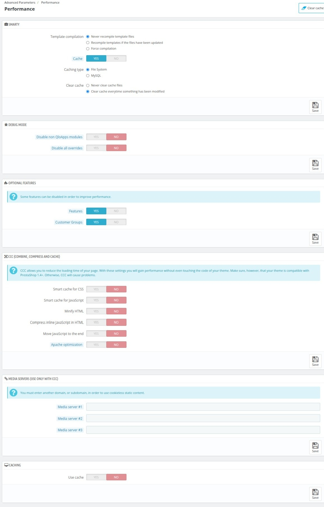

# Performance 
The Performance Settings page allows you to optimize your QloApps website for better speed and responsiveness. It includes various settings to manage caching, debugging, optional features, and optimization techniques.

### Smarty Configuration
- **Template Compilation**: 
  - **Never recompile template files**: Improves performance by using precompiled templates without checking for updates.
  - **Recompile templates if the files have been updated**: Automatically updates templates when changes are made.
  - **Force Compilation**: Recompile all template files on every page load; useful for development but not recommended for live websites.

- **Cache**: Enables or disables caching for templates to improve loading speed.

- **Caching Type**: 
  - **File System**: Stores cached files on the server.
  - **MySQL**: Uses the database for caching.
- **Clear Cache**:
  - **Never clear cache files**: Retains cached files indefinitely.
  - **Clear cache every time something has been modified**: Automatically removes outdated cache when changes are made.

---

### Debug Mode
- **Disable non-QloApps modules**: Prevents non-core modules from running, useful for troubleshooting performance issues.
- **Disable all overrides**: Stops all overridden functionalities, ensuring only core features are active.

### Optional Features
- **Features**: Enables or disables specific features to enhance performance. Turning off unused features can significantly reduce page load times.
- **Customer Groups**: Allows you to enable or disable customer group functionalities based on your needs.

### CCC (Combine, Compress, and Cache)
This section focuses on reducing the loading time of your website by optimizing resources:
- **Smart Cache for CSS**: Combines and compresses CSS files.
- **Smart Cache for JavaScript**: Combines and compresses JavaScript files.
- **Minify HTML**: Reduces the size of HTML by removing unnecessary characters.
- **Compress Inline JavaScript in HTML**: Compresses JavaScript code embedded within HTML.
- **Move JavaScript to the End**: Ensures JavaScript files load last to prioritize other resources.
- **Apache Optimization**: Activates server-level optimizations for faster performance (requires Apache server).

---

### Media Servers (Use Only with CCC)
- **Media Server #1, #2, #3**: Allows you to configure domains or subdomains for serving static content (e.g., images, CSS, JavaScript). This can improve performance by enabling cookieless content delivery.

---

### Caching
- **Use Cache**: Enables or disables caching at the application level to improve loading speed and reduce server load.

---

### **Best Practices for Performance Settings**
- Use caching wherever possible to reduce load times.
- Optimize CCC settings to combine and compress resources, but ensure compatibility with your theme before enabling them.
- Disable unused features and modules to streamline the website's functionality.
- Use media servers for static content to improve delivery speed.
- Regularly monitor and adjust settings based on your website's needs and performance metrics.