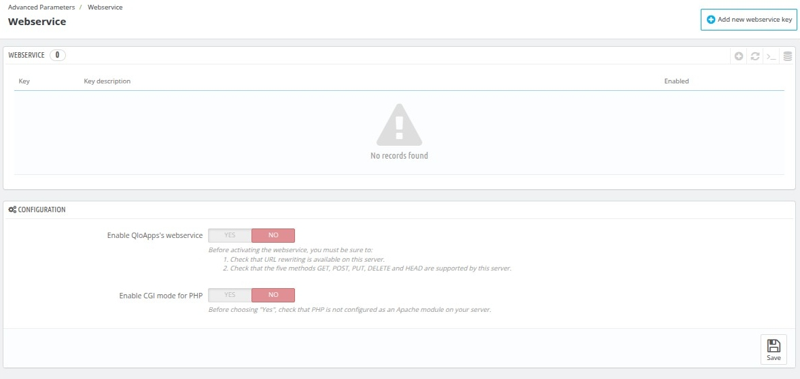
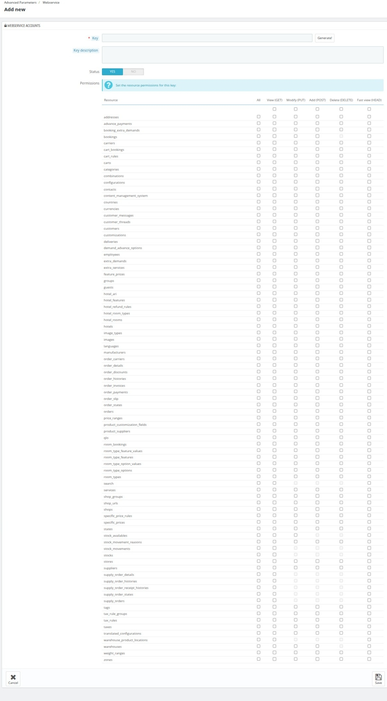

# Webservice

The Webservice sub-tab allows you to manage and configure the Webservice API for your QloApps.

## Add new Webservice

Click the "Add new webservice" button to create a new API key.

  #### Key:
  This field will automatically generate a unique key for your Webservice.

#### Key Description:

Enter a descriptive name for this Webservice key. This will help you identify and organize different keys later on.

#### Status:
Select YES to enable the Webservice key.

#### Permissions

Select all the permissions you want to provide to the API.

#### Saving the Key

After filling in the necessary information, click the **"Save"** button.

**3. Configuration**

- **Enable QloApps's Webservice:**
-
    * **Description:** This option enables or disables the Webservice API for your QloApps installation.
    * **Note:** Before enabling the Webservice, ensure that:
        * URL rewriting is available on your server.
        * The server supports the following HTTP methods: GET, POST, PUT, DELETE, and HEAD.

* **Enable CGI mode for PHP:**
    * **Description:** This option enables CGI mode for PHP.
    * **Options:** YES, NO.
    * **Note:** Before enabling CGI mode, ensure that it is not configured as an Apache module on your server.

**4. Save**

* Click the "Save" button at the bottom of the page to save any changes made to the Webservice configuration.