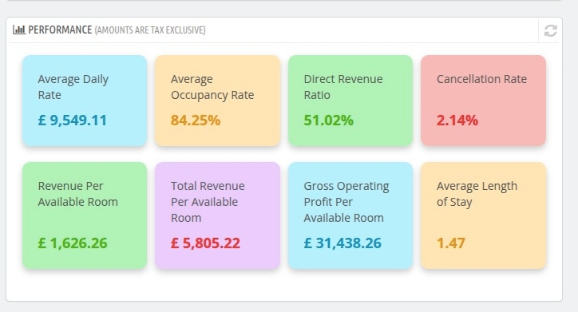

# Performance

The Performance section of the dashboard tab provides key performance metrics for analyzing the financial and operational health of your property.

It highlights revenue-related figures, room utilization, guest behavior, and overall profitability. Below is a detailed explanation of its components:

## The statics include:

### **1. Average Daily Rate (ADR)**
- **Description:** The average revenue earned per occupied room over a given period.
- **Formula:**  `Average Daily Rate = Total Room Revenue ÷ Number of Occupied Rooms`
- **Example:** An ADR of **₹ 8,110.71** means each occupied room generates this amount on average.
- **Purpose:** Helps evaluate room pricing strategies and revenue performance.

### **2. Average Occupancy Rate**
- **Description:** The percentage of available rooms that are occupied during a period.
- **Formula:** `Occupancy Rate = (Occupied Rooms ÷ Total Rooms) × 100`
- **Purpose:** Helps measure room demand and adjust pricing or marketing strategies.

### **3. Direct Revenue Ratio**
- **Description:** The percentage of revenue generated through direct bookings compared to total revenue.

- Direct revenue is the income of a business earns from its core products or services, while total revenue is the total amount of income a business earns from all of its revenue streams.

- **Formula:** `Direct Revenue Ratio = (Direct Revenue ÷ Total Revenue) × 100`

### **4. Cancellation Rate**
- **Description:** The percentage of bookings that were canceled relative to total bookings.
- **Formula:** `Cancellation Rate = (Canceled Bookings ÷ Total Bookings) × 100`

### **5. Revenue Per Available Room (RevPAR)**
- **Description:** The revenue earned per available room, regardless of occupancy.
- **Formula:** `RevPAR = Total Room Revenue ÷ Number of Available Rooms`
OR
`RevPAR = Average Daily Rate * Occupancy Rate`

### **6. Total Revenue Per Available Room (TRevPAR)**
- **Description:** Total revenue earned per available room, includes revenue earned by amenities such as spas, pools, entertainment areas, and restaurants.
- **Formula:** `TRevPAR = Total Revenue ÷ Total Available Rooms`

### **7. Gross Operating Profit Per Available Room (GOPPAR)**
- **Description:** Profit generated per available room after operating expenses.
- **Formula:** `GOPPAR = Gross Operating Profit ÷ Number of Available Rooms`

### **8. Average Length of Stay (ALOS)**
- **Description:** The average number of nights guests stay per booking.
- **Formula:** `ALOS = Total Room Nights ÷ Total Bookings`

This section is essential for identifying opportunities to enhance both revenue and operations.

[def]: ./performance.png