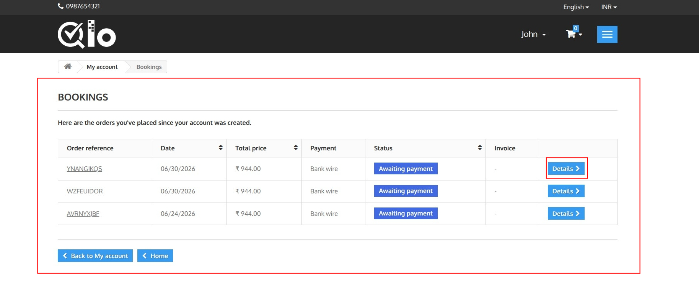
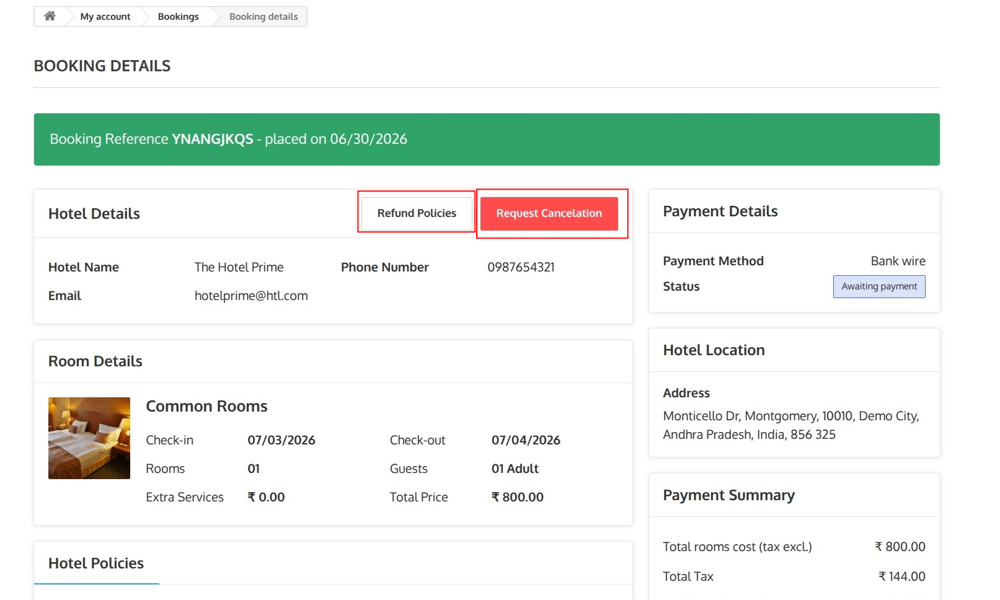
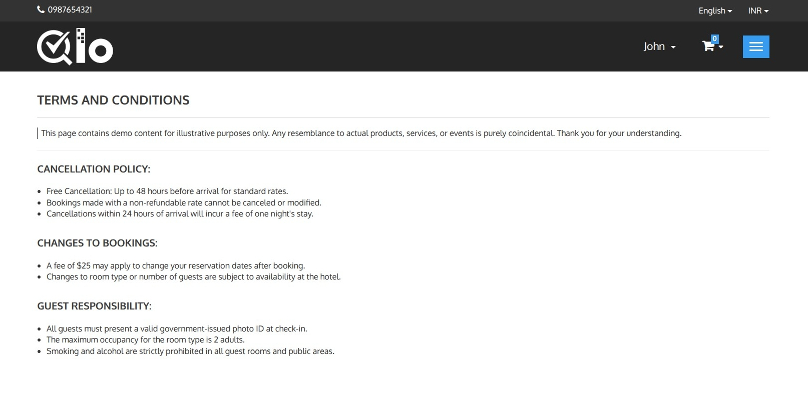
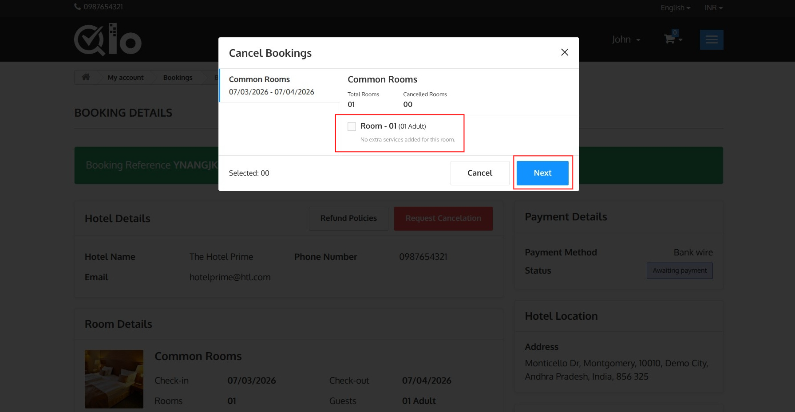
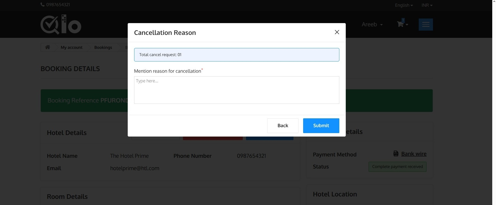
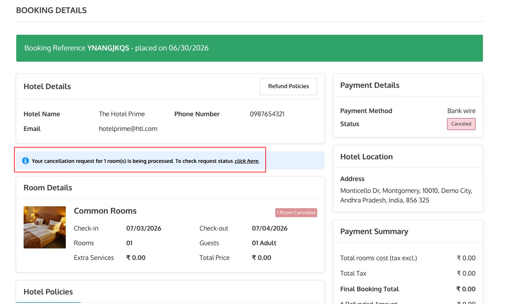
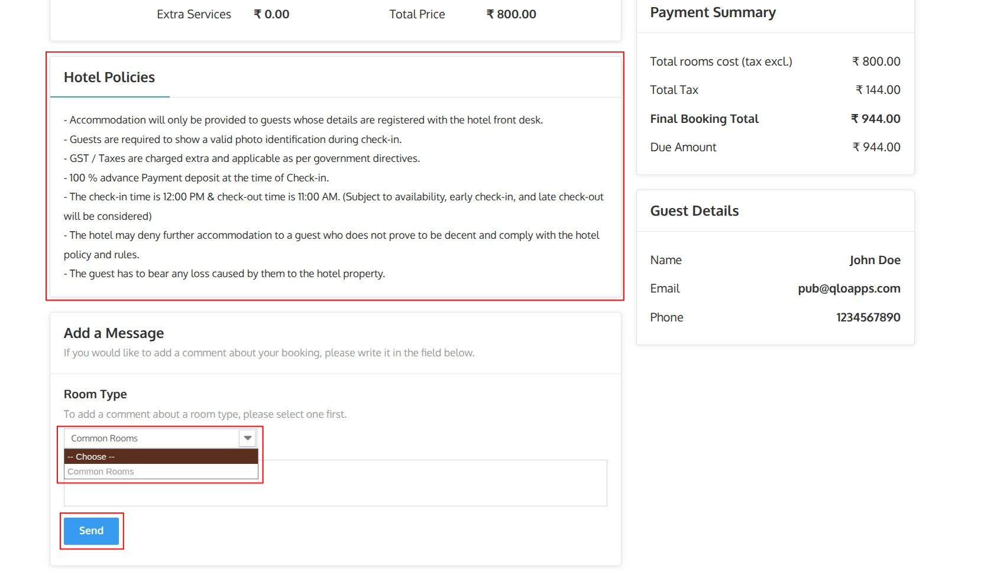

# Booking History

The **Booking History** page displays all bookings made using your account. From this page, you can review your booking details, payment method, booking status, and access individual reservation information.

Guests can access this page in either of the following ways:

- Click **View your order history** on the **Booking Confirmation** page.
- Navigate to **My Account → Bookings** after signing in to your account.

The page displays the following information for each booking:

- **Order Reference:** Unique booking reference number.
- **Date:** Booking creation date.
- **Total Price:** Total booking amount.
- **Payment:** Selected payment method.
- **Status:** Shows the status of the payment.
- **Invoice:** Displays the invoice if available.
- **Details:** Click **Details** to view the complete booking information.

## Booking Details

The **Booking Details** page allows guests to review their reservation and manage booking-related actions.

## Refund Policies

The **Refund Policies** page displays the hotel's terms and conditions applicable to the reservation.

Guests can access this page by clicking **Refund Policies** from the **Booking Details** page.

The page may include information such as:

- Cancellation policy
- Refund eligibility
- Booking modification policy
- Guest responsibilities
- Other terms and conditions applicable to the reservation

Guests are advised to review these policies before requesting a cancellation.

> **Note for Administrators:** To enable Order Refunds, navigate to Hotel Reservation System → Manage Order Refund Rules → Order Refund Settings and enable the Order Refund option. For more information, refer to the QloApps documentation: [Manage Order Refund Rules](https://docs.qloapps.com/hrs/manage_refund_rules/)

> **Note for Administrators:** CMS pages can be managed from the Back Office. Navigate to **Preferences → CMS**, edit the **Terms and Conditions** page, and update the required content.

## Request Cancellation

If you wish to cancel your booking and request a refund, open the **Booking Details** page and click **Request Cancellation**.

The **Cancel Bookings** window displays the rooms included in the reservation.

To continue:

1. Select the room(s) you want to cancel.
2. Review the booking details, including the room type, stay dates, and number of cancelled rooms.
3. Click **Next** to proceed with the cancellation request.

The window displays the total number of cancellation requests selected.

Enter the reason for cancellation in the **Mention reason for cancellation** field. This field is mandatory.

Click **Submit** to send the cancellation request to the hotel.

After the request is submitted, it is sent to the hotel for review. The hotel administrator can approve or reject the request according to the configured cancellation policy.

> **Note for Administrators**: Cancellation and refund requests submitted by guests can be viewed and managed from Hotel Reservation System → Manage Order Refund Requests in the Back Office. For more information, refer to the QloApps documentation: [Manage Order Refund Requests](https://docs.qloapps.com/hrs/manage_refund_request/).

## Cancellation Request Status

After submitting the cancellation request, you are redirected to the **Booking Details** page.

A notification is displayed confirming that the cancellation request has been submitted successfully and is currently being processed by the hotel.

To check the status of the refund click on **Click here**.

The booking details are also updated to reflect the cancellation request, including:

- The current payment status.
- The number of cancelled rooms.

## Hotel Policies

The **Hotel Policies** section displays the policies applicable to your reservation, such as check-in/check-out timings, identification requirements, taxes, payment terms, cancellation policies, and other hotel rules.

Guests are advised to review these policies before their stay.

> **Note for Administrators:** Hotel policies can be managed from Hotel Reservation System → Manage Hotels by editing the desired hotel. For more information, refer to the QloApps documentation: [Add a New Hotel](https://docs.qloapps.com/hrs/manage_hotel/#add-a-new-hotel).

## Add a Message

The **Add a Message** section allows guests to send additional instructions or requests related to their booking.

To send a message:

1. Select the **Room Type** from the dropdown list.
2. Enter your message in the text box.
3. Click **Send** to submit your message.

The message will be associated with the selected room type and shared with the hotel.

> **Note for Administrators**: Guest messages are available in the Back Office under Customers → Customer Service. For more information, refer to the QloApps documentation: [Customer Service](https://docs.qloapps.com/customers/customer_service/customer_service.html#view-customer-service).
