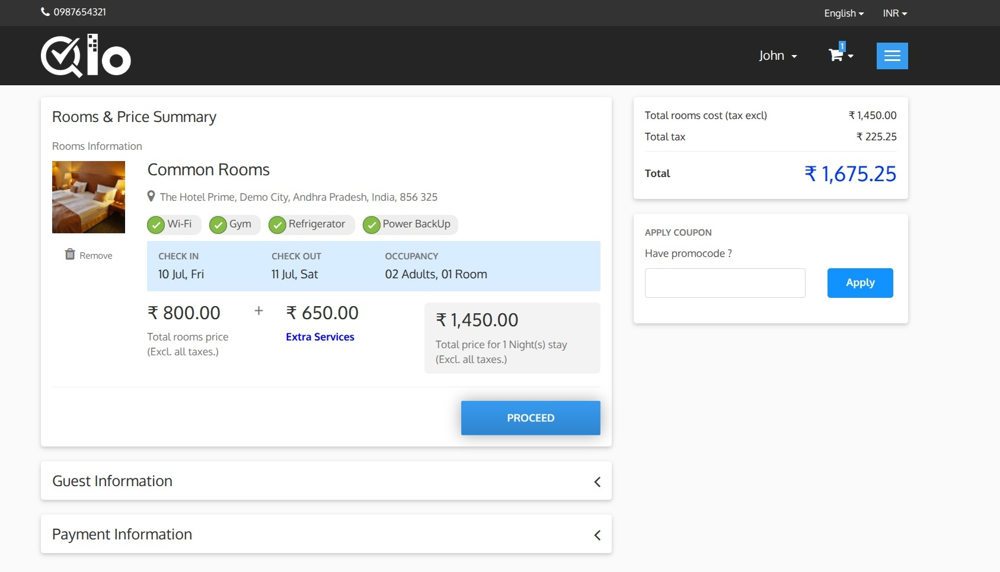
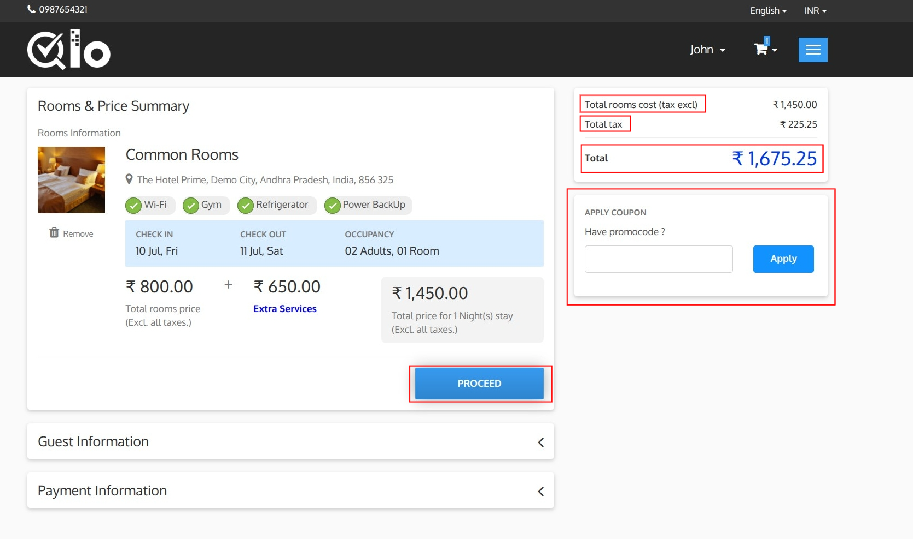

# Checkout Page

The Checkout Page allows guests to review their booking details, apply coupon codes, enter guest information, select a payment method, and complete the reservation.

The **Rooms & Price Summary** section displays the details of the selected room, including:

* Room name and image
* Hotel information
* Room amenities
* Check-in and check-out dates
* Occupancy details
* Room price
* Total room cost

Guests can click **Remove** to remove the room from the booking.

## Booking Total

The Booking Total section provides a detailed breakdown of the reservation cost.

### Total Rooms Cost (Tax Excl.)

Displays the total cost of all selected rooms without tax.

### Total Tax

Displays the total tax amount calculated based on the room charges and the tax rules configured by the hotel.

### Total

Displays the final amount payable by the guest, including room charges and applicable taxes.

## Apply Coupon

If a promotional code is available, enter it in the coupon field and click **Apply** to receive the applicable discount.

> **Note for Administrators:** Coupons can be created and managed from **Manage Discounts → Cart Rules** in the Back Office. For more information, refer to the QloApps documentation: [Cart Rules](https://docs.qloapps.com/discounts/cart_rule/).

## Proceed

After reviewing the booking details, click **Proceed** to continue to the Guest Information section.
