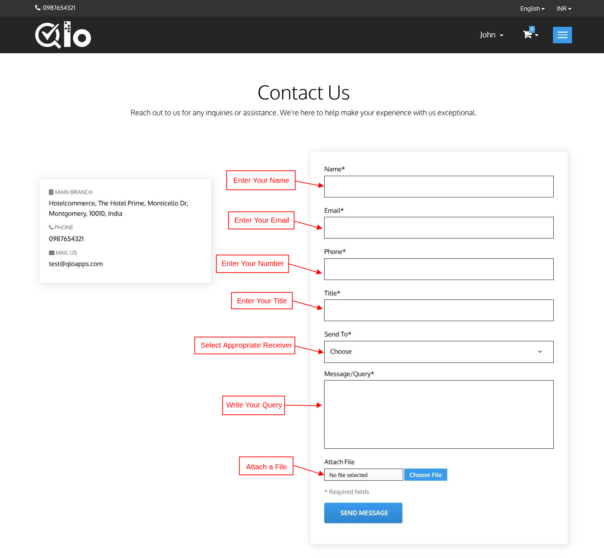

# Contact Us

The **Contact Us** page allows users to send inquiries, support requests, or feedback directly to the hotel.

## Send a Message

To submit an inquiry, provide the following information:

- Name
- Email Address
- Phone Number
- Subject
- Recipient
- Message/Query
- Attachment (Optional)

After entering the required details, click **Send Message** to submit your request.

> **Note for Administrators:** Messages submitted through the **Contact Us** page can be viewed and managed from the Back Office by navigating to **Customers → Customer Service**. For more information, refer to the QloApps documentation: [Customer Service](https://docs.qloapps.com/customers/customer_service/customer_service.html#view-customer-service)

> **Note for Administrators**: To display the list of hotels on the Contact Us page, navigate to Hotel Reservation System → General Settings → Website Configuration and enable Display Contact Page Hotel List.
