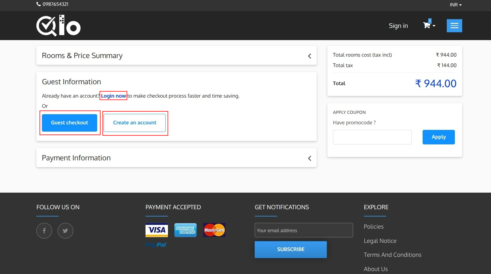
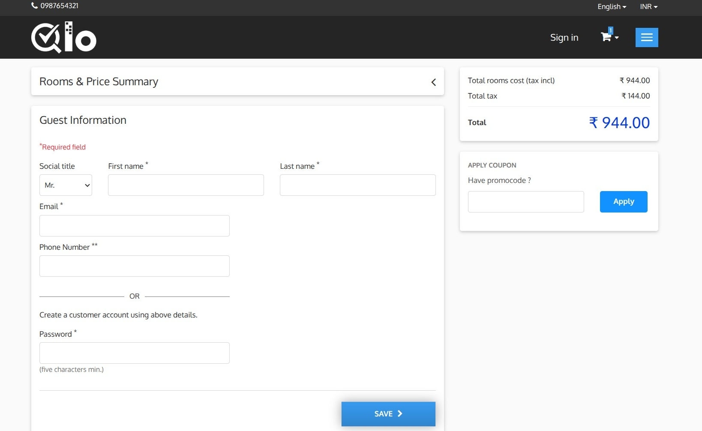
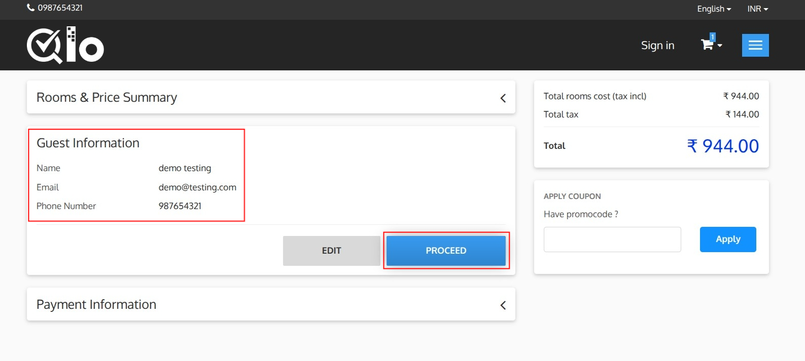
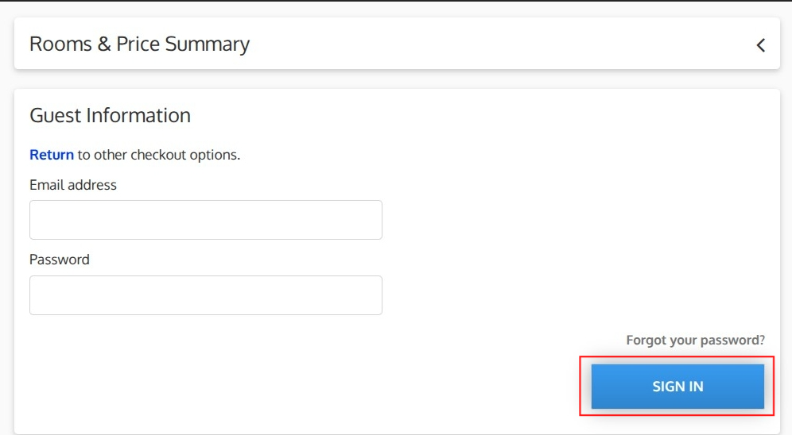
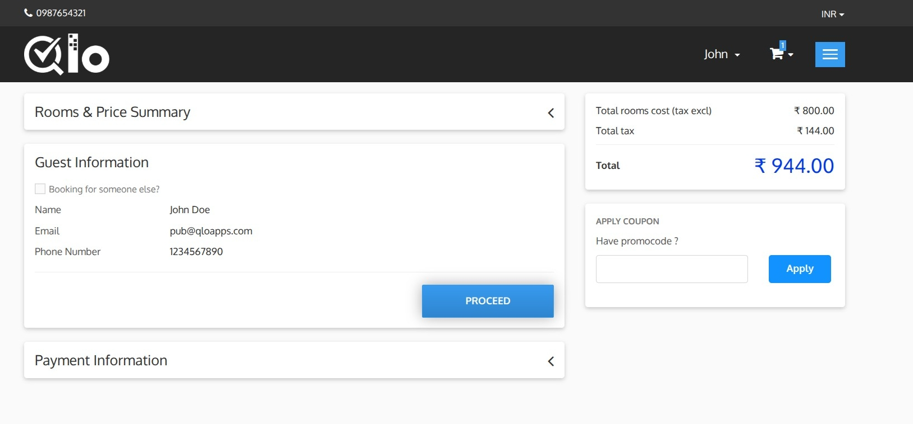
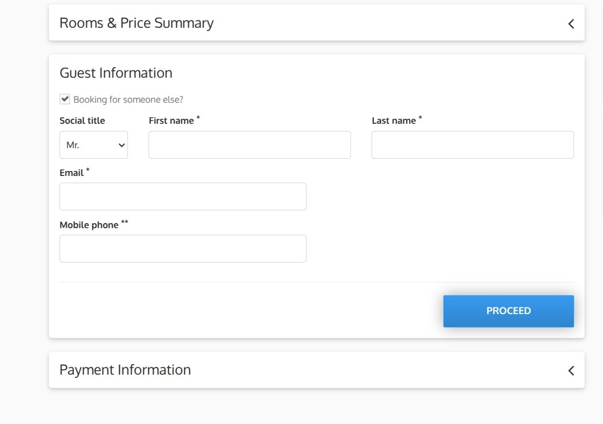

# Guest Information

The Guest Information section allows guests to choose how they would like to proceed with the booking.

Guests can select one of the following options:

- **Login Now:** Sign in using an existing account to continue the booking.
- **Guest Checkout:** Complete the booking without creating an account.
- **Create an Account:** Register a new account before proceeding with the booking.

## 1. Guest Checkout

Guests can complete the booking process without creating an account by using the **Guest Checkout** option. This allows first-time or one-time visitors to make a booking quickly without registering on the website.

During Guest Checkout, guests must provide the following information:

* Social Title
* First Name
* Last Name
* Email Address
* Phone Number

Fields marked with an asterisk (*) are mandatory.

> **Note for Administrators:** Guest Checkout can be enabled or disabled from **Preferences → Orders → General → Enable Guest Checkout**. For more information, refer to the QloApps documentation: [General](https://docs.qloapps.com/preferences/orders/#general)

After entering the required details, click **Save**.

The entered information is saved and displayed in a summary view within the **Guest Information** section. Guests can review the information before continuing with the checkout process.

The summary displays:

* **Name:** Displays the guest's full name.
* **Email:** Displays the registered email address.
* **Phone Number:** Displays the contact number provided during Guest Checkout.

Guests can perform the following actions:

* **Edit:** Click **Edit** to modify the guest information. The Guest Information form will reopen, allowing changes before continuing.
* **Proceed:** Click **Proceed** to continue to the **Payment Information** section.

## 2. Registered User Checkout

Select **Login Now** to sign in using an existing account.

## Login Information

Enter the following details:

* **Email Address:** Enter the email address associated with your account.
* **Password:** Enter your account password.

## Forgot Password

If you cannot remember your password, click **Forgot your password?** to reset your account password.

## Sign In

After entering your credentials, click **Sign In** to log in and continue with the booking process.

After signing in, your personal details are automatically displayed in the Guest Information section, including:

- Name
- Email Address
- Phone Number

This information is retrieved from your account and will be used for the reservation.

## Booking for Someone Else

If you are making a reservation on behalf of another person, select the Booking for Someone Else? checkbox and enter the guest's details.

After reviewing the guest information, click **Proceed** to continue to the Payment Information section.
