# Home Page
The Home Page is the default landing page of the QloApps Front Office. It introduces guests to the hotel, highlights key amenities, showcases available rooms, and provides direct access to the booking process.

The homepage is designed to help visitors quickly learn about the property and start making reservations from a single page.

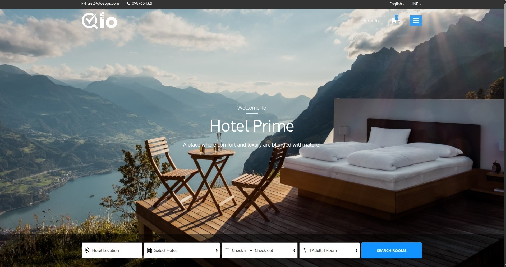

Key Components
- Header Section
- Hero Banner Section
- Room Search Panel
- Hotel Interior Section
- Hotel Amenities Section
- Room Listing Section
- Guest Testimonials
- Footer Section

## Header Section

The Header Section is displayed at the top of every page in the QloApps Front Office.

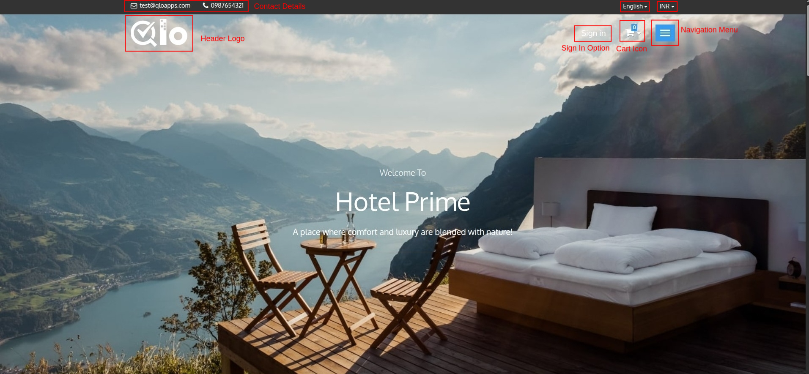

- **Hotel logo**: The hotel logo helps visitors identify the property and strengthens brand recognition. Guests can click the logo from any page to return to the Home Page.

    > **Note for Administrators:** To change the website header logo displayed on the Front Office, navigate to **Preferences → Themes → Logo → Header Logo** in the Back Office and upload the desired logo. For more information, refer to the QloApps documentation: https://docs.qloapps.com/preferences/themes/#add-new-theme

- **Contact**: The contact section displays the hotel's phone number and email address.

    > **Note for Administrators:** The support email address and phone number displayed in the Front Office header can be configured from **HRS → General Settings → General Settings → Hotel Configuration → Support Contact Details**. For more information, refer to the QloApps documentation: https://docs.qloapps.com/hrs/general_settings/#general-settings-2

- **Language Selector**: The **Language Selector** allows guests to browse the website in their preferred language. Selecting a language updates the website content, making it easier for guests to navigate and complete their bookings.

    > **Note for Administrators:** Additional languages can be added or managed from **Localization → Languages**. For more information, visit our QloApps documentation: https://docs.qloapps.com/localization/languages/

- **Currency Selector**: The **Currency Selector** allows guests to view room rates and booking prices in their preferred currency. Selecting a different currency updates the displayed prices across the website.

    > **Note for Administrators:** Currencies can be managed from **Localization → Currencies**. For more information, visit our QloApps documentation: https://docs.qloapps.com/localization/currency/

- **Sign In**: The Sign In option allows registered customers to access their accounts and manage their bookings. When clicked, guests will land on the authentication page.

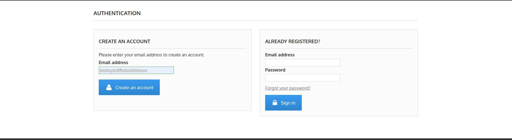

The Authentication page includes:

- **Create an Account**: Allows new customers to register using their email address.
- **Already Registered:** Allows existing customers to sign in using their email address and password.
- **Forgot Your Password**: Allows registered customers to reset their account password.

After entering an email address on the Create an Account section, guests are redirected to the registration page.

The registration form includes:

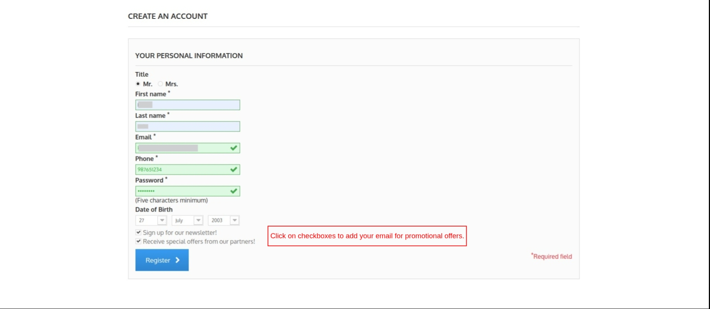

- **Personal Information**: Allows guests to enter their personal details.
- **Newsletter Subscription**: Guests can subscribe to hotel updates and promotional offers.
- **Register**: Creates a new customer account.

 Note: Fields marked with an asterisk (*) are mandatory.
- **Booking cart**: The booking cart icon allows guests to view rooms added to their reservation and review booking details before checkout.

- **Navigation menu**- The Navigation Menu helps guests access important pages without scrolling through the entire website.

Hotels can add CMS pages, theme pages, and custom links to the navigation menu.  

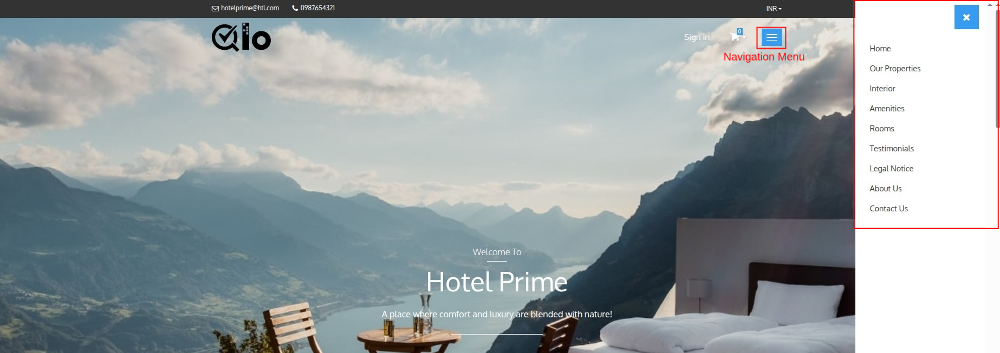

Administrators can:

- Add CMS pages
- Add theme pages
- Add custom URLs
- Display links in the navigation menu
- Display links in the footer section

> **Note for Administrators:** Navigation links can be managed from the Back Office by navigating to **Modules & Services → Manage Modules → Navigation Block → Configure**. From here, you can add **CMS pages**, **theme pages**, and **custom URLs** to the navigation menu. You can also choose which links are displayed in the **Navigation Menu** and the **website footer**.

> **Note for Administrators:** CMS pages can be created and managed from the Back Office by navigating to **Preferences → CMS**. From here, you can create new CMS pages including their titles and content. For more information, refer to the QloApps documentation: https://docs.qloapps.com/preferences/cms/

## Hero Banner Section

The Hero Banner is the primary promotional area of the homepage. It creates the first impression for visitors and highlights the hotel's identity.

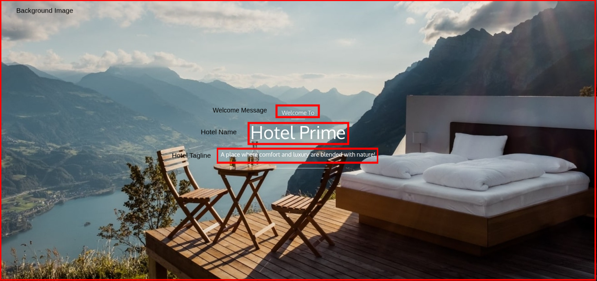

- **Background image**: Displays a banner image representing the hotel property.
- **Welcome message**: Shows a greeting message for visitors.
- **Hotel name**: Displays the hotel name prominently on the homepage.
- **Hotel tagline**: Displays a short promotional message or slogan that reflects the hotel's brand and services.

> **Note for Administrators:** Website-related settings, such as the homepage header background image, Contact Us page options, Our Properties link, and other Front Office display configurations, can be managed from **HRS → General Settings → General Settings → Website Configuration**. For more information, refer to the QloApps documentation: https://docs.qloapps.com/hrs/general_settings/#general-settings-2

## Room Search Panel

- **Room Search Panel**: The Room Search Panel allows guests to check room availability based on their preferred stay dates and occupancy requirements.

Guests can enter the following details:
- **Hotel Location**: Allows guests to specify the preferred hotel location.
- **Select Hotel**: Displays available hotels configured in the system.
- **Check-in and Check-out Dates**: Guests can select their arrival date & departure date. The system uses these dates to calculate room availability.
- **Occupancy Selection**: Allows guests to specify number of adults and rooms.
- **Search Rooms**: After entering the required information, guests can click **Search Rooms** to view available accommodations.

> **Note for Administrators:** If you want guests to search for rooms **without selecting occupancy**, navigate to **Preferences → Room Types → Search** and set **Front End Search Type** to **Search without occupancy**. For more information, refer to the QloApps documentation: https://docs.qloapps.com/preferences/room_types/#search

> **Note for Administrators:** If you do not want guests to search by hotel location, you can disable the **Hotel Location** field from **HRS → General Settings → Search Panel Settings → Enable Hotel Location**. For more information, refer to the QloApps documentation: https://docs.qloapps.com/hrs/general_settings/#general-settings-2

## Hotel Interior Block

The Hotel Interior Block displays a gallery of images showcasing hotel rooms, facilities, and surrounding spaces.

This section helps guests visualize the property before making a reservation.

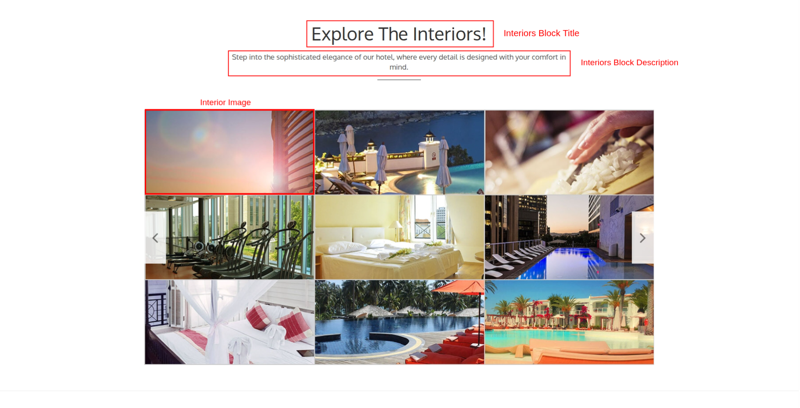

The block includes:

- **Interiors Block Title**: Displays the title of the Interiors section.
- **Interiors Block Description**: Displays a brief introduction to the hotel's interiors and facilities.
- **Interior Image**: Displays images of hotel rooms, amenities, and other property areas.

> **Note for Administrators:** The **Hotel Interior Block** displayed on the Front Office homepage can be configured from **HRS → General Settings → Hotel Interior Block**. For more information, refer to the QloApps documentation: https://docs.qloapps.com/hrs/general_settings/#hotel-interior-block

## Hotel Amenities Block

The Hotel Amenities Block highlights the facilities and services available at the hotel. It helps guests understand the experience and conveniences offered during their stay.

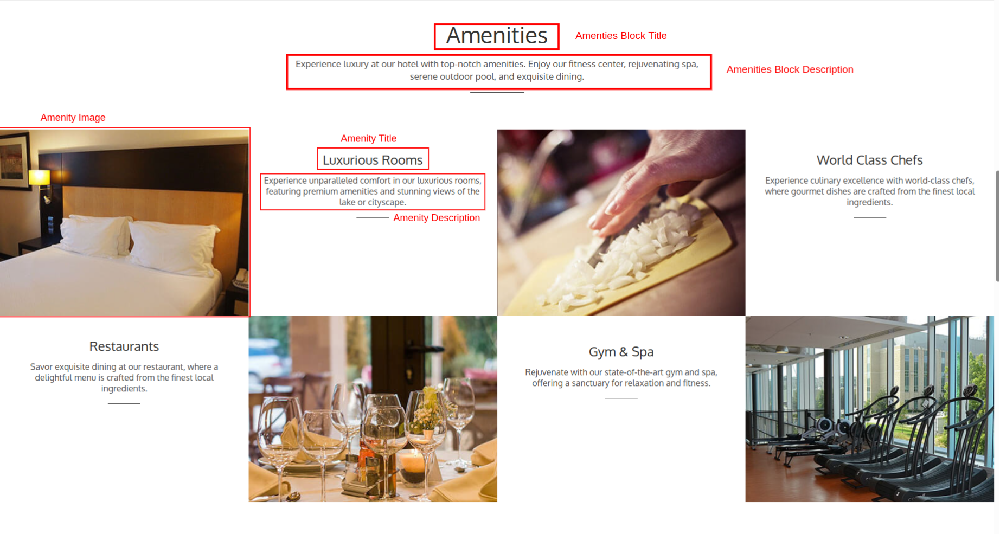

Each amenity card may include:
- **Amenities Block Title**: Displays the title of the Amenities section.
- **Amenities Block Description**: Displays a brief introduction to the hotel's facilities and services.
- **Amenity Image**: Displays a visual representation of the facility.
- **Amenity Name**: Shows the name of the service or facility.
- **Amenity Description**: Provides a brief overview of the amenity and its benefits.

> **Note for Administrators:** The **Hotel Amenities Block** displayed on the Front Office homepage can be configured from **HRS → General Settings → Hotel Amenities Block**. For more information, refer to the QloApps documentation: https://docs.qloapps.com/hrs/general_settings/#hotel-amenities-block

## Our Rooms Section
The Our Rooms Section displays available room types on the hotel website. Guests can view room details, compare pricing, and start the reservation process.

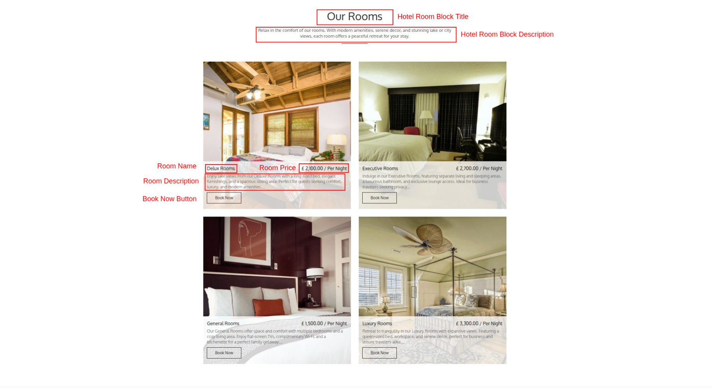

Each room card includes:
- Room Block Title: Displays the title of the room section.
- Room Block Description: Displays a brief introduction to the available room types.
- Room Image: Displays a preview image of the room.
- Room Name: Shows the room type available for booking.
- Room Description: Provides a brief overview of the room and its features.
- Room Price: Displays the room rate per night.
- Book Now: Allows guests to proceed with booking the selected room.

> **Note for Administrators:** The **Our Rooms** section can be configured from **Modules & Services → Manage Modules → Display Hotel Rooms → Configure**. From here, administrators can manage the section title, description, and select the room types to display on the Front Office.

Note: Only active room types are displayed in the Our Rooms Section.

## Guest Testimonials Section
The Guest Testimonials Section displays reviews and feedback from previous guests. It helps build trust and gives potential customers insight into guest experiences.

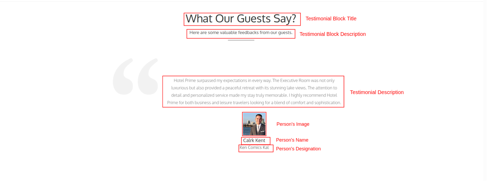

Each testimonial includes:

- Guest Review: Displays the guest's feedback about their stay.
- Guest Name: Shows the name of the reviewer.
- Designation: Displays the guest's designation or company, if provided.
- Guest Image: Displays the reviewer's profile image.

> **Note for Administrators:** The **Guest Testimonials** section can be managed from **Modules & Services → Manage Modules → Hotel Testimonial → Configure**. From here, administrators can add, edit, or remove testimonials displayed on the Front Office homepage.

## Footer Section

The Footer Section appears at the bottom of the QloApps Front office and contains additional navigation and informational links.

> **Note for Administrators:** To display navigation links in the website footer, navigate to **Modules & Services → Manage Modules → Navigation Block → Configure**, then enable the **Show at Footer Block** option for the required pages or links.

Enable Show at Footer Block for the required pages.

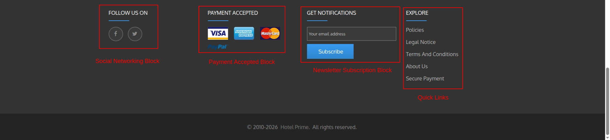

- **Social Networking Block**: Guests can connect with the hotel through social platforms such as Facebook or Twitter etc.

    > **Note for Administrators:** The social media links displayed in the **Social Networking** section can be managed from **Modules & Services → Manage Modules → Social Networking Block → Configure**. From here, administrators can add, edit, or remove social media profiles displayed on the Front Office.

- **Payment Accepted Block**: The Payment Accepted Block section displays accepted payment gateways and payment cards. Examples include Visa, American Express, PayPal etc.

    > **Note for Administrators:** The payment methods displayed in the **Payment Accepted** section of the Front Office footer can be managed from **Modules & Services → Manage Modules → Footer Payment Accepted Block → Configure**. From here, administrators can add, edit, or remove the payment methods and their corresponding icons displayed to guests.

- **Newsletter Subscription Block**: The Newsletter Subscription section allows guests to subscribe using their email address to receive promotional offers and hotel updates.
    
- **Quick Links**: Allows guests to quickly access legal and informational content without searching through the website.   Provides access to important pages such as: Policies, Legal notice. Terms and Conditions, About Us and Secure Payment.

    > **Note for Administrators:** The links displayed in the Front Office footer can be managed from **Modules & Services → Manage Modules → Navigation Block → Configure**. Enable the **Show at footer block** option for the required CMS pages or links to make them visible in the website footer.
