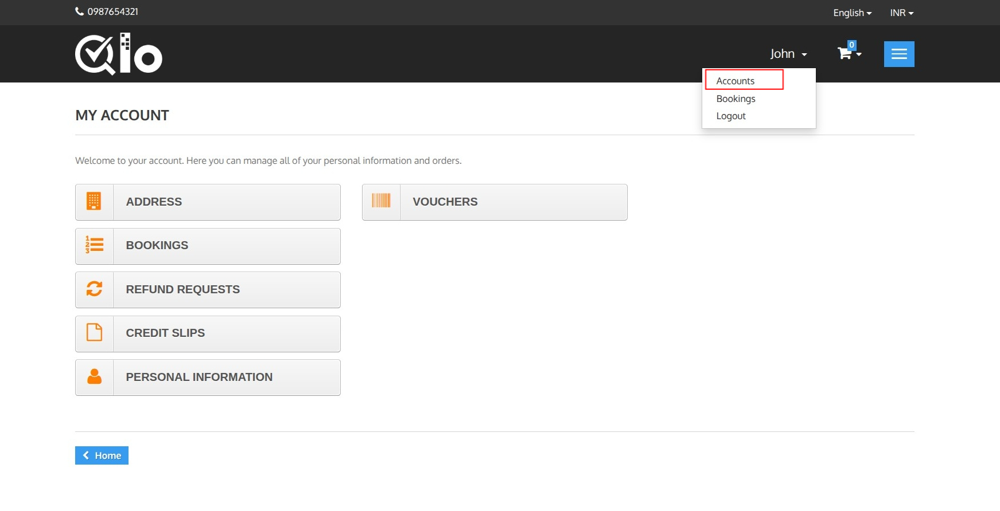
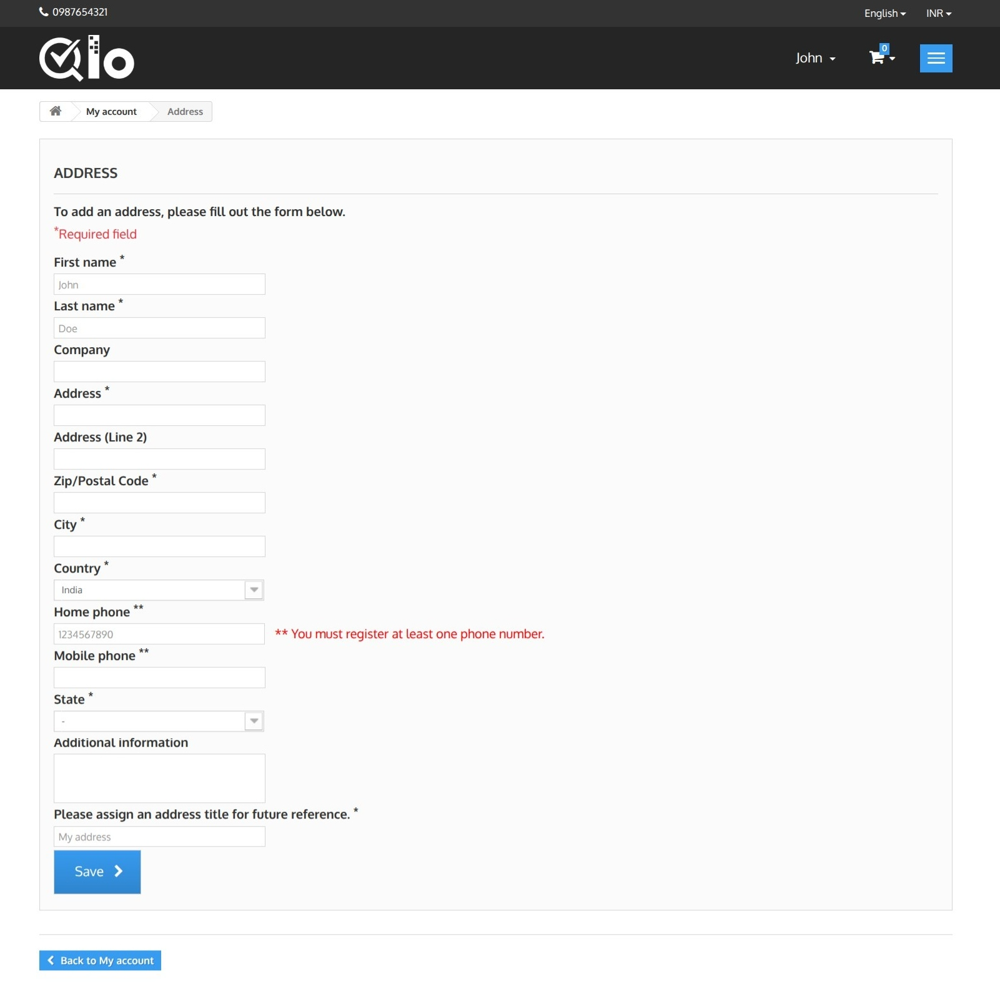
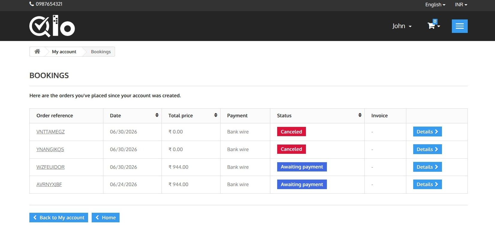
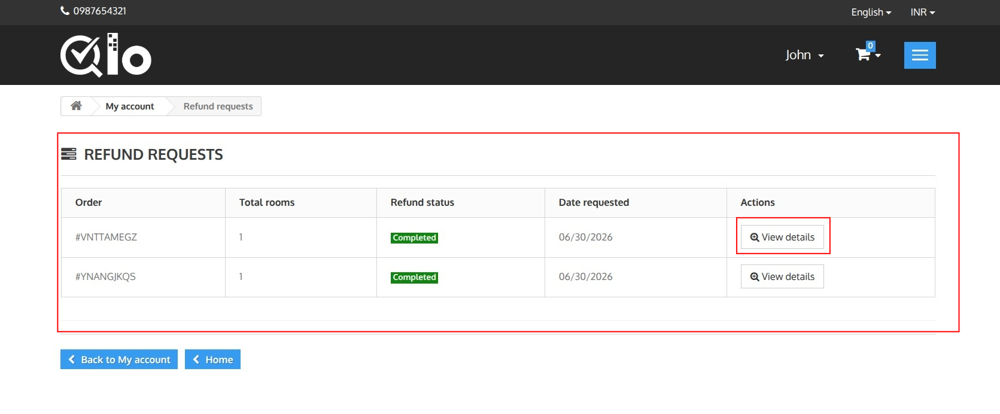
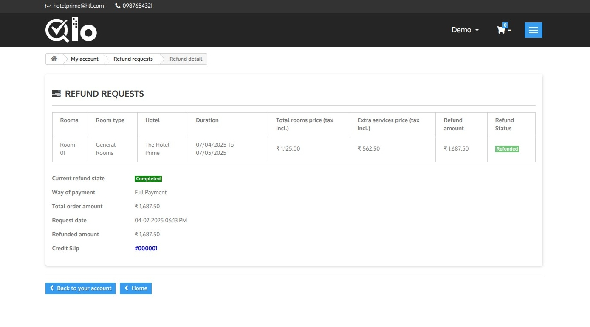
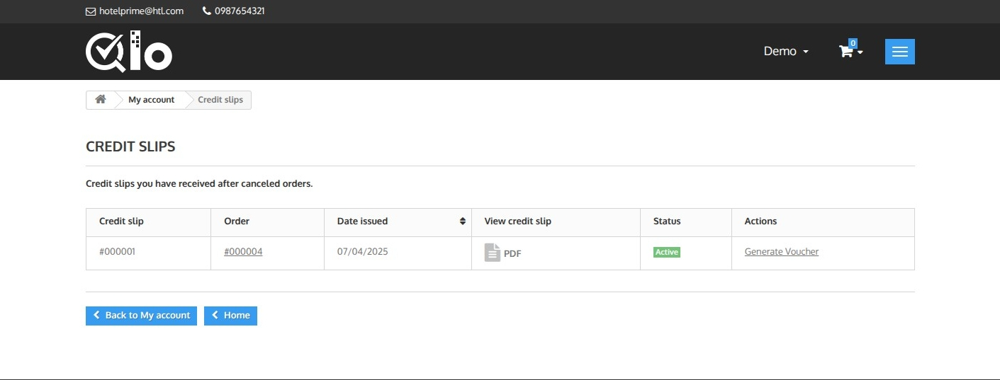
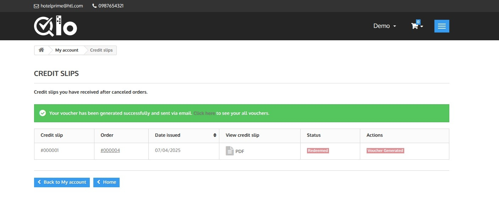
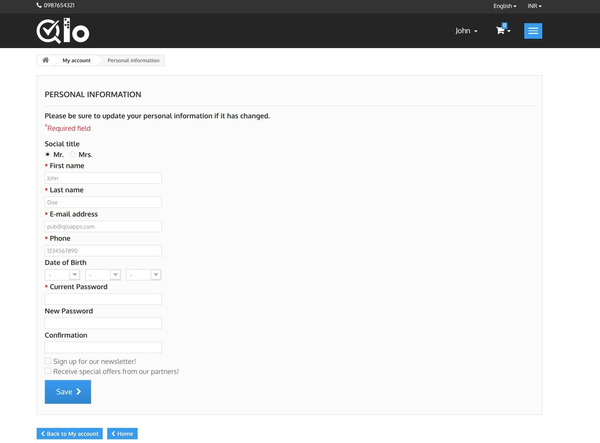
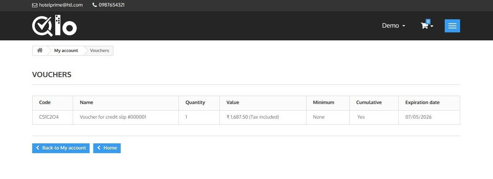

# My Account

The **My Account** page allows logged-in users to manage their account information, bookings, refund requests, and other account-related details.

The page can be accessed by clicking the drop down arrow and selecting **Accounts**.

## Available Options

The following options are available on the My Account page:

- **Address:** Manage saved addresses.
- **Bookings:** View booking history and booking details.
- **Refund Requests:** View the status of submitted refund requests.
- **Credit Slips:** View credit slips generated for refunded bookings.
- **Personal Information:** Update personal details such as name, email, password, and phone number.
- **Vouchers:** View available discount vouchers associated with the account.

## Address

The **Address** section allows users to save and manage their billing or contact address for future bookings.

### Add Address

Fill in the required address information, including:

- First Name
- Last Name
- Company (Optional)
- Address
- ZIP/Postal Code
- City
- Country
- State
- Home or Mobile Phone
- Additional Information (Optional)
- Address Title

Fields marked with an asterisk (*) are mandatory.

After entering the required details, click **Save** to store the address in your account for future use.

## Bookings

The **Bookings** section displays all reservations made from your account.

The booking list includes the following information:

- **Order Reference:** Unique booking reference number.
- **Date:** Date the booking was created.
- **Total Price:** Total booking amount.
- **Payment:** Selected payment method.
- **Status:** Current booking status (e.g., Awaiting Payment, Confirmed, or Canceled).
- **Invoice:** View or download the invoice, if available.

To view complete booking information, click **Details** next to the desired booking.

## Refund Requests

The **Refund Requests** section displays all refund requests submitted for your bookings.

The refund request list includes the following information:

- **Order:** Booking reference for which the refund was requested.
- **Total Rooms:** Number of rooms included in the refund request.
- **Refund Status:** Current status of the refund request (e.g., Pending, Processing, or Completed).
- **Date Requested:** Date on which the refund request was submitted.

To view complete refund information, click **View Details** next to the desired refund request.

### Refund Details

The **Refund Details** page provides complete information about a submitted refund request.

The page includes:

- **Room Details:** Room type, hotel name, stay duration, room charges, extra service charges, and refund amount.
- **Refund Status:** Current status of the refund request (e.g., Completed or Pending).
- **Payment Method:** Payment type used for the booking.
- **Total Order Amount:** Original booking amount.
- **Request Date:** Date and time the refund request was submitted.
- **Refunded Amount:** Amount refunded to the customer.
- **Credit Slip:** Credit slip generated for the refunded booking, if available.

## Credit Slips

The **Credit Slips** page allows guests to view all credit slips issued for eligible refunded or canceled bookings. Each credit slip includes the associated booking reference, issue date, current status, and an option to download it as a PDF for future reference.

If voucher generation is enabled by the hotel, guests can click **Generate Voucher** to convert the available credit amount into a voucher. The voucher can be applied during future online bookings to receive a discount equal to the available credit, subject to the hotel's voucher and refund policies.

The **Status** column indicates whether the credit slip is currently active and available for use.

> **Note for Administrators:** Credit slips are automatically generated for eligible refunded bookings based on the configured refund settings. Guests can access their credit slips from **My Account → Credit Slips**. For more information about credit slips and refunds, refer to the documentation: [Credit Slips](https://docs.qloapps.com/orders/credit_slips/).

### Voucher Generated

Once the voucher is generated successfully, a confirmation message is displayed. The credit slip status changes to **Redeemed**, and the action is updated to **Voucher Generated**, indicating that the credit amount has been converted into a voucher.

The generated voucher is also sent to the guest's registered email address. Guests can click **Click here to see your all vouchers** in the confirmation message to view the list of available vouchers in their account.

## Personal Information

The **Personal Information** section allows users to update their account details and change their password.

### Update Personal Information

Users can modify the following details:

- Social Title
- First Name
- Last Name
- Email Address
- Phone Number
- Date of Birth

To change the account password, enter the **Current Password**, then provide and confirm the **New Password**.

Users can also choose to subscribe to the newsletter and receive promotional offers.

After updating the required information, click **Save** to apply the changes.

## Vouchers

The **Vouchers** page displays all vouchers available in the guest's account. Vouchers can be generated from eligible credit slips and used as a payment method for future bookings.

Each voucher includes the following details:

- **Code:** Unique voucher code.
- **Name:** Description of the voucher.
- **Quantity:** Number of times the voucher can be used.
- **Value:** Total voucher amount available.
- **Minimum:** Minimum booking amount required to apply the voucher, if any.
- **Cumulative:** Indicates whether the voucher can be combined with other vouchers.
- **Expiration Date:** Last date on which the voucher can be redeemed.

Guests can use the voucher code during checkout to receive the applicable discount on eligible bookings.
