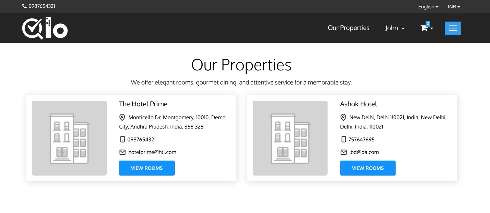

# Our Properties

The **Our Properties** page displays all hotels managed through the QloApps installation. It allows guests to browse available properties and view their basic details before proceeding to book a room.

The page includes the following information for each property:

* **Hotel Image:** Displays the featured image of the hotel.
* **Hotel Name:** Name of the property.
* **Hotel Address:** Shows the complete address of the hotel.
* **Phone Number:** Contact number for the property.
* **Email Address:** Hotel email address.
* **View Rooms:** Redirects guests to the selected hotel's room listing page, where they can browse available room types and continue with the booking process.

> **Note for Administrators:** The **Our Properties** page can be enabled from **HRS → General Settings → Website Configuration → Display Our Properties link in Header**. For more information, refer to the QloApps documentation: [General Settings](https://docs.qloapps.com/hrs/general_settings/#general-settings-2)
