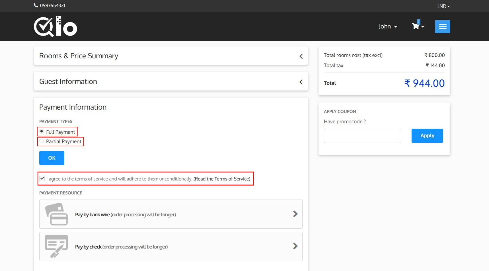
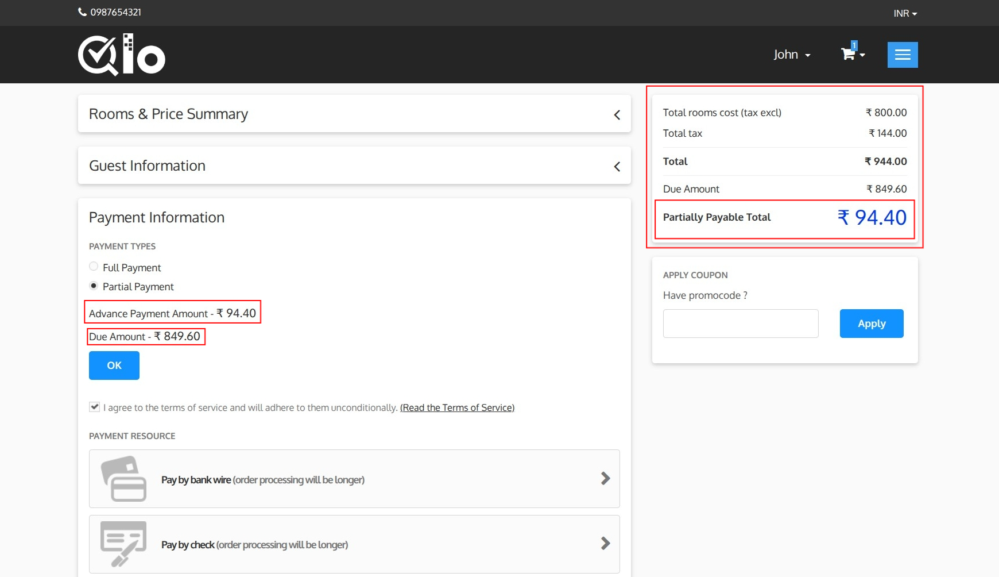
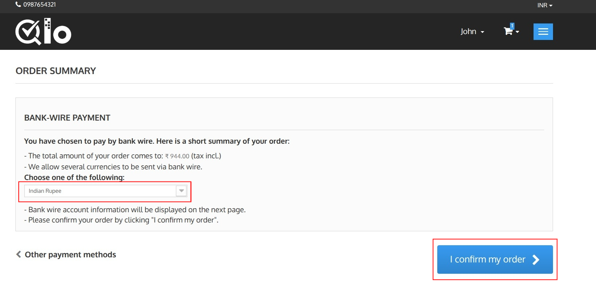

# Payment Information

The Payment Information section allows guests to select their preferred payment option and complete the booking.

## Payment Type

Depending on the hotel's configuration, various payment options may be available, and guests can choose the one that best suits their convenience.

### 1. Full Payment:
Select **Full Payment** to pay the entire booking amount at the time of reservation.

### 2. Partial Payment:

Select **Partial Payment** to pay only the advance amount required to confirm the reservation. The remaining balance can be paid later according to the hotel's payment policy.

After selecting **Partial Payment**, the following details are displayed:

* **Advance Payment Amount:** The amount to be paid immediately to confirm the booking.
* **Due Amount:** The remaining balance to be paid later.

The **Booking Summary** section is also updated to display:

* **Total Amount:** The total booking cost, including applicable taxes.
* **Due Amount:** The outstanding balance after the advance payment.
* **Partially Payable Total:** The advance payment amount due at the time of booking.

Click **OK** to confirm the selected payment type and proceed with the payment.

> **Note for Administrators:** Administrators can enable **Advance Payment**  from **Hotel Reservation System → General Settings → Advance Payment Global Settings**. The minimum booking amount can be set as a **percentage of the booking amount**. For more information, refer to the QloApps documentation: **https://docs.qloapps.com/hrs/general_settings/#general-settings-2**.

Guests must agree to the hotel's terms and conditions before proceeding with the payment. To review the terms, click **Read the Terms of Service**.

## Payment Methods

The available payment methods are displayed in the **Payment Resource** section.

Available payment methods depend on the hotel's configuration and may include:

* Bank Wire
* Check
* Online Payment Gateways
* Pay at hotel

Select the preferred payment method to proceed with the payment.

### Bank Wire Payment

In this guide, the payment process is demonstrated using the **Bank Wire** payment method. Depending on the payment methods configured by the hotel, guests may choose any available payment option during checkout.

After selecting **Bank Wire** as the payment method, the Order Summary page is displayed.

- **Currency Selection**: If multiple currencies are supported, select the preferred currency from the dropdown list.

- **Order Summary**: The Order Summary section displays the booking details, selected payment method, and the total amount payable for the reservation.

### Confirm Order

After reviewing the booking details, click **I confirm my order** to place the booking.

### Other Payment Methods

Click **Other payment methods** to return to the Payment Information page and select a different payment method.
