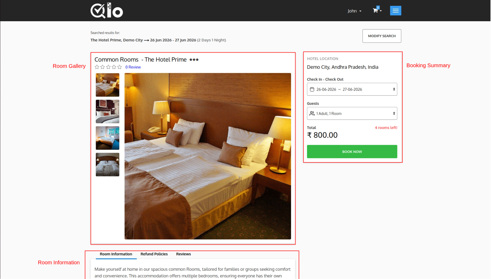
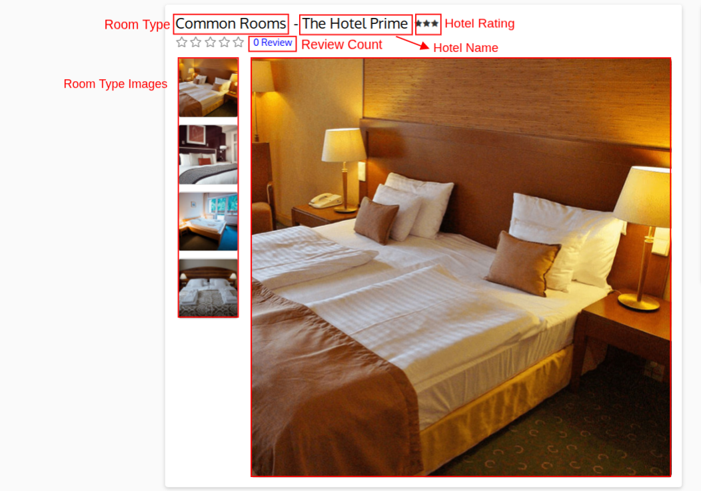
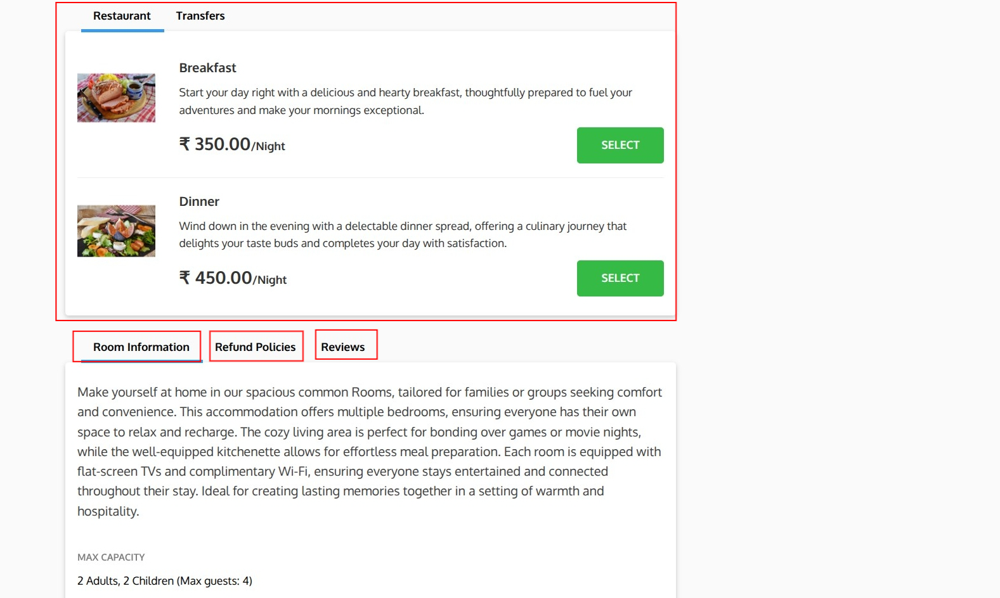
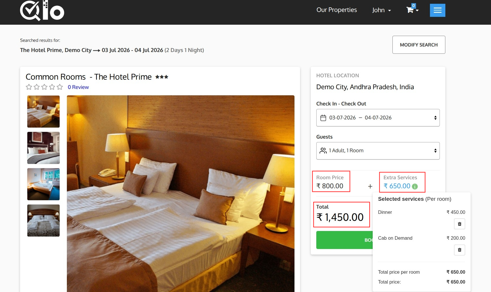

# Room Detail Page

The Room Detail Page provides detailed information about the selected room. Guests can view room images, pricing, amenities, occupancy details, hotel policies, and proceed with booking.

## Room Gallery

The Room Gallery displays images and basic information about the selected room.

It includes:

* **Room Type:** Displays the name of the selected room.
* **Hotel Name:** Displays the hotel offering the selected room.
* **Guest Rating:** Displays the room's rating based on guest reviews.
* **Review Count:** Displays the total number of guest reviews.
* **Main Room Image:** Displays a large preview image of the room.
* **Room Image Thumbnails:** Displays additional room images. Guests can click a thumbnail to view it in the main image area.

> **Note for Administrators:** Room images can be managed from the Back Office by navigating to **Catalog → Manage Room Types**, selecting the desired room type and opening the **Images** section. For more information, refer to the QloApps documentation: [Images](https://docs.qloapps.com/catalog/manage_room_types/#images-section)

## Extra Services

If the hotel offers additional services, they are displayed in this section under different categories such as **Restaurant** and **Transfers**. Guests can browse the available services, review their descriptions and pricing, and click **Select** to add them to their booking.

> **Note for Administrators:** Extra services can be managed from **Catalog → Manage Service Products** in the Back Office. While creating a service product, you can associate it with one or more hotels and specific room types, allowing you to control which services are available for each room. For more information, refer to the QloApps documentation: [Manage Service Products](https://docs.qloapps.com/catalog/manage_service_products/)

## Room Information

The **Room Information** tab displays a detailed description of the room along with important information such as its maximum occupancy and other room-specific details.

## Refund Policies

The **Refund Policies** tab displays the cancellation and refund terms applicable to the selected room. Guests can review these policies before completing their reservation.

## Reviews

The **Reviews** tab displays ratings and feedback shared by previous guests, helping future guests make informed booking decisions.

> **Note for Administrators:** Guest reviews are submitted by customers after their stay and are displayed automatically on the **Reviews** tab once approved.

## Booking Summary

The **Booking Summary** panel displays a real-time overview of the selected room and booking details.

It includes:

* **Hotel Location:** Displays the selected hotel's location.
* **Check-in & Check-out:** Displays the selected stay dates.
* **Guests:** Displays the selected occupancy.
* **Room Price:** Displays the price of the selected room.
* **Extra Services:** Displays the total cost of the selected extra services. Click the **information (i)** icon to view the selected services along with their individual prices.
* **Total:** Displays the combined cost of the room and selected extra services.
* **Book Now:** Adds the selected room and extra services to the cart and proceeds with the booking process.
