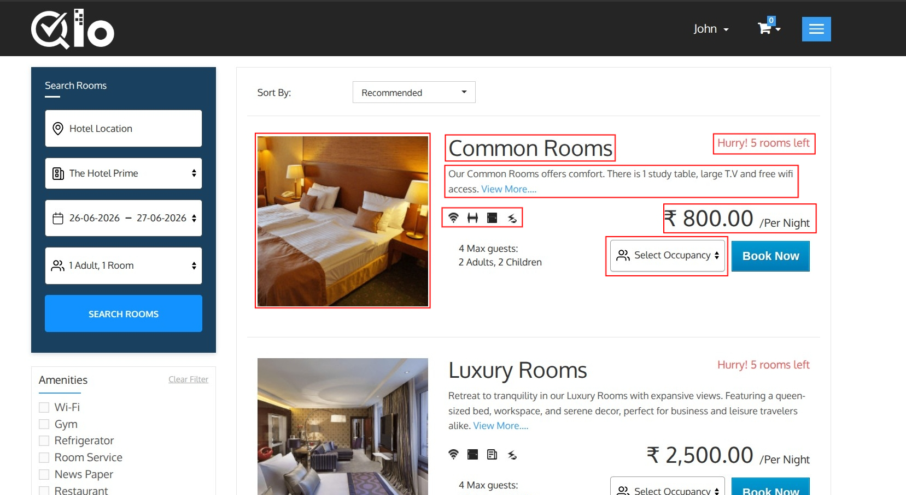
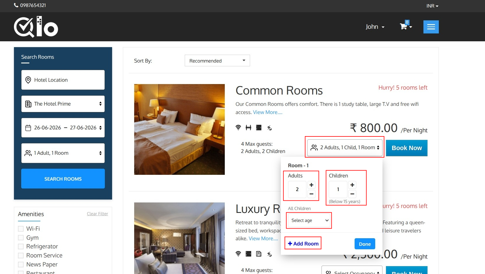
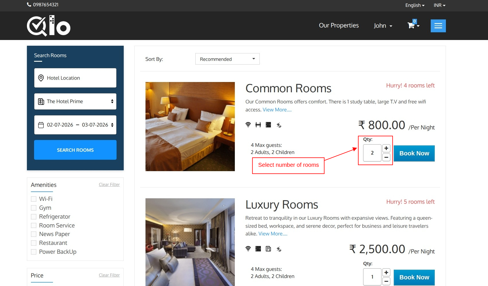
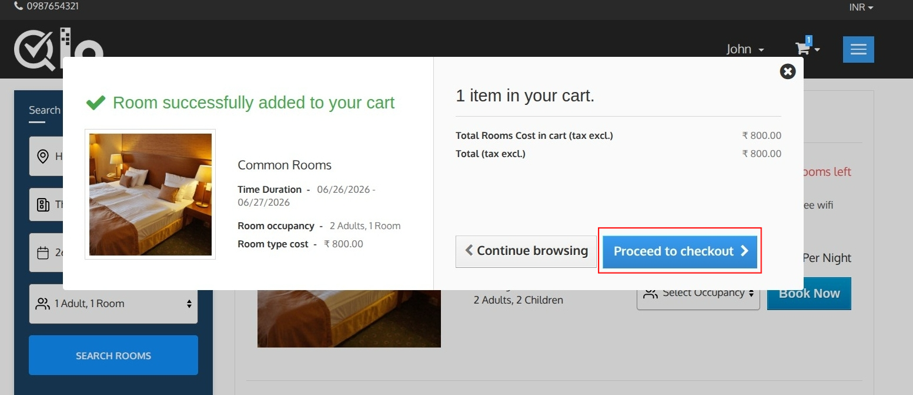
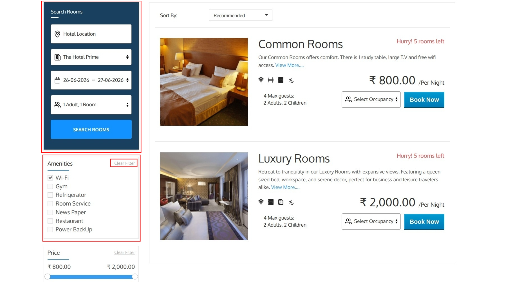
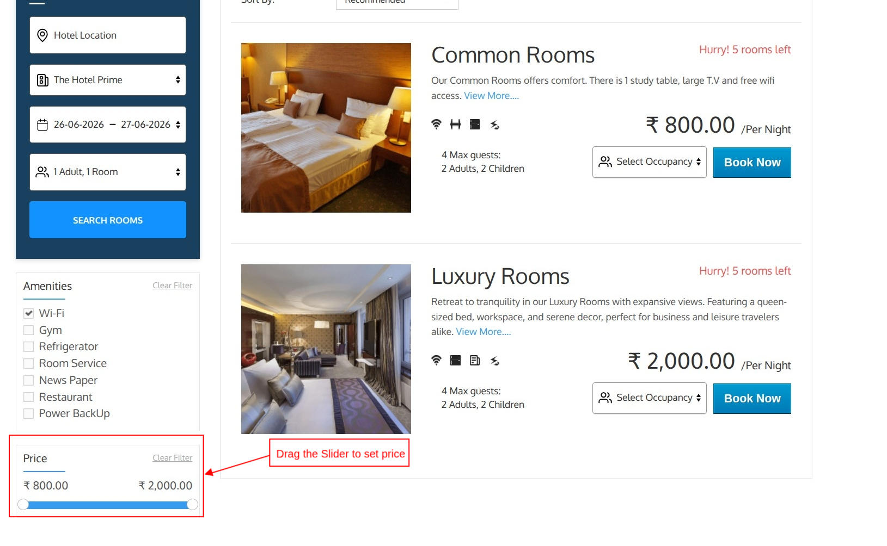

# Room Listing Page
The Room Listing page displays all rooms available for the selected hotel, stay dates, and occupancy details. Guests can compare room options, apply filters, review pricing, and proceed with booking.

Each room card includes the following information:

**Room Image:** Displays a preview image of the room, allowing guests to get a quick visual overview of the accommodation.

**Room Name:** Displays the name of the room type available for booking.

**Room Description:** Provides a brief summary of the room, including its features and facilities.
To view additional information about the room, click **View More**.

> **Note for Administrators:** Room details such as the name, price, and description can be updated from Catalog → Manage Room Types by editing the desired room type. Changes are automatically reflected on the Front Office.

**Room Amenities:** Displays the amenities and services available in the room using icons and labels.

**Occupancy Details:** Shows the maximum number of guests that can be accommodated in the room, including the number of adults and children allowed.

**Example:**

* Maximum Guests: 4
* Adults: 2
* Children: 2

**Availability Status:** Displays the current room availability. If only a few rooms remain, a notification such as **"Hurry! Only 5 Rooms Left"** may be displayed.

**Room Price:** Displays the room rate per night.

**Select Occupancy**

The **Select Occupancy** option allows guests to specify the number of rooms, adults, and children for their stay before proceeding with the booking.

Click the Select Occupancy dropdown to open the occupancy configuration panel.

**Occupancy Configuration**

Guests can configure the occupancy details for each room individually.

- **Adults:** Select the number of adults staying in the room.
- **Children:** Select the number of children staying in the room.

When children are added, guests must specify the age of each child. The child's age is used to determine occupancy eligibility and apply any child-specific pricing or policies configured by the hotel.

- **Add Room:**
Click **Add Room** to include an additional room in the reservation. A separate occupancy section will be created for the new room, allowing guests to configure adults and children for each room individually.

- **Save Occupancy:**

 After selecting the number of adults, children, and entering the ages of all children, click **Done** to save the occupancy details.

**Note**: QloApps supports two different booking methods for the Front Office:

**1) Room Occupancy:** Guests select the number of adults and children for each room before booking. This option is ideal when occupancy-based pricing or occupancy restrictions are used.

**2) Rooms Quantity (No. of rooms):** Guests simply select the number of rooms they want to book without specifying occupancy during room selection.

> **Note for Administrators**: To configure the preferred booking method from the Back Office, navigate to Preferences → Room Types → Search → In front-end, add rooms to cart with and choose either Room Occupancy or Rooms Quantity (No. of rooms). For more information, refer to the QloApps documentation: [Search](https://docs.qloapps.com/preferences/room_types/#search)

**Book Now**

Click **Book Now** to add the selected room to your cart. A confirmation pop-up will appear, allowing you to continue browsing or proceed to checkout.

## Search Panel
The search panel allows guests to modify their search without returning to the homepage.

- **Hotel Location:** Select your preferred location where you would like to stay.

- **Hotel Name:** Select the desired hotel from the dropdown list.

- **Stay Dates:** Modify the check-in and check-out dates for your reservation.

- **Occupancy:** Update the number of guests and rooms required.

Now Click on **Search Rooms** to refresh the room availability based on the updated search criteria.

## Amenities Filter
The Amenities filter helps guests find rooms with specific facilities.

Available amenities may include:

- Wi-Fi
- Gym
- Refrigerator
- Room Service
- Newspaper
- Restaurant
- Power Backup

Select one or more amenities to filter the room results.

To remove all applied filters, click **Clear Filter.**

> **Note for Hotel Administrators:** The amenities displayed in this filter are managed from the Back Office. Navigate to Catalog → Features to add, modify, or remove amenities.

## Price Filter
The Price Filter allows guests to narrow down room results based on their preferred price range. This helps users quickly find accommodations that match their budget.

**Setting a Price Range:**

 The filter displays the minimum and maximum room prices available for the selected search criteria.

Guests can:

- Drag the left slider handle to set the minimum price.
- Drag the right slider handle to set the maximum price.
- View rooms that fall within the selected price range.

As the price range is adjusted, the room listings are automatically updated to display only the rooms that match the selected budget.

**Clear Filter:**

 Click **Clear Filter** to remove the selected price range and display all available rooms.

> **Note for Administrators:** To disable the **Price Filter** and **Amenities Filter** from the Back Office by navigating to **Modules & Services**, searching for **Layered Filters and Sorting Block**, and clicking **Configure**. From there, disable the **Price Filter** and **Amenities Filter** options.
