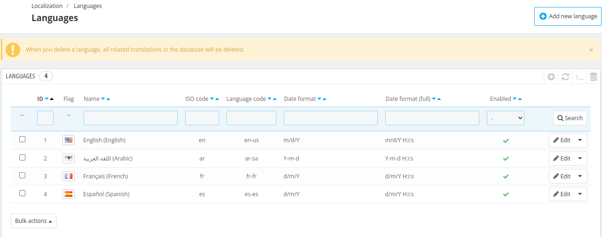
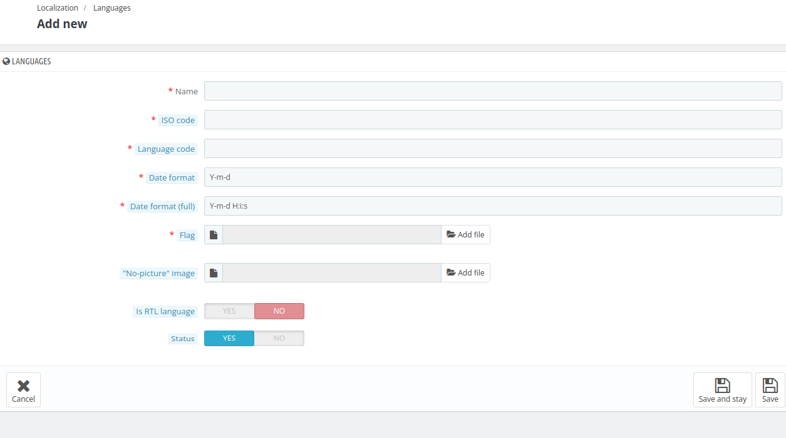

# Languages

The **languages section** allows you to manage the languages in which the text of your back office and the website will be displayed, both for you as the admin and for your users.

You can easily enable or disable any language present in the list by clicking on the icon in the **Enabled** column.

## Add new language

To add a new language click on add new language then admin have to fill in the following fields:

- **Name**: Enter the name of the language.

- **ISO code**: Enter the 2-letter ISO 639-1 code of the language.

- **Language code**: Enter the  4-letter language code, in the form xx-yy, xx being the language ISO code, and yy the country ISO code, using ISO 3166-1 alpha-2.

- **Date format**: Enter the format for the date.

- **Date format (full)**: Enter the details of date format including the hour-minute format.

- **Flag**: Upload the flag of the country.

- **"No-picture" image**: This image will be displayed when no picture is found.

- **RTL language**: Some languages are written from right to left, enable this option if this  is one of those language.

- **Status**: Using the status option you can enable or disable this language.

then click on save.

## Edit a language

To edit a language, click the edit option and complete all the details in the same way as you did when adding it.

*Note- you can change default your language from  [Localisation](../localization/) menu.*

